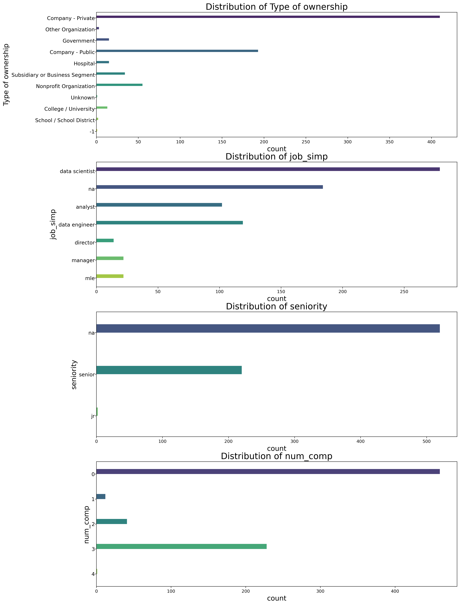
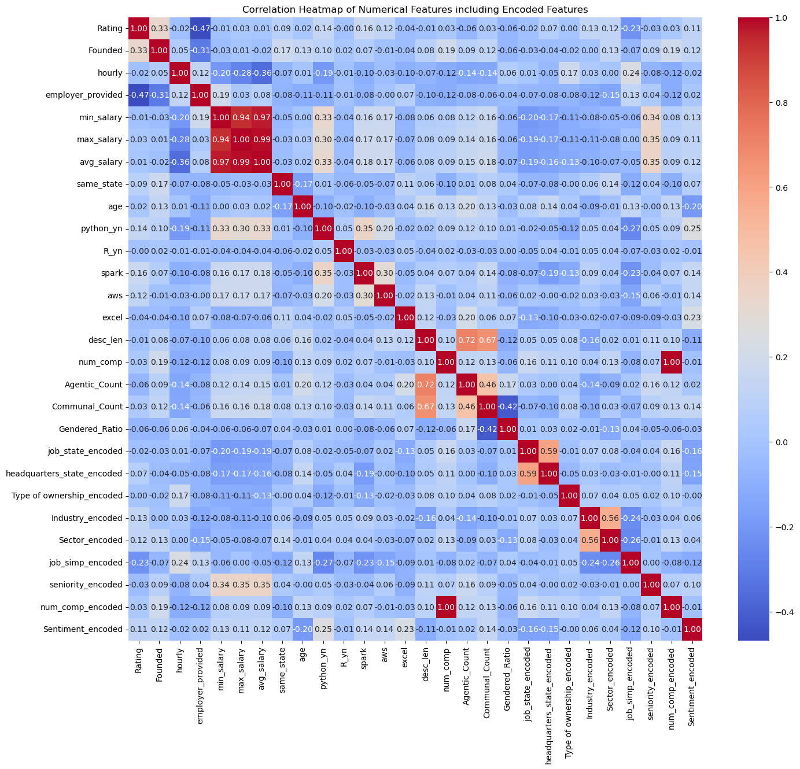
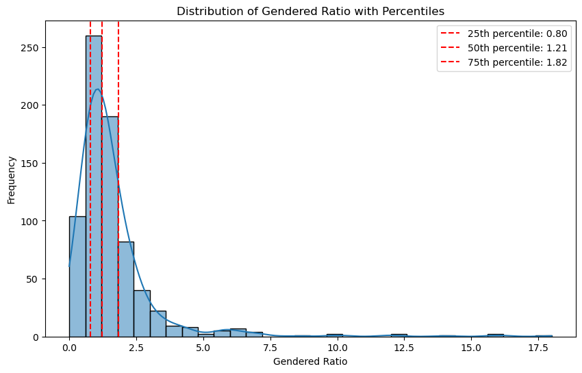
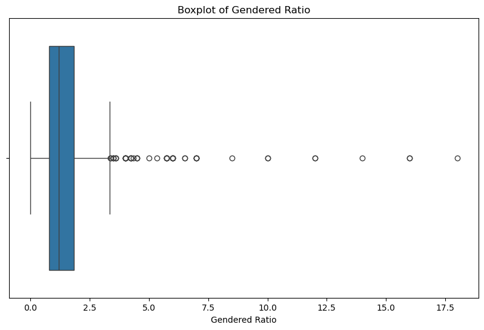
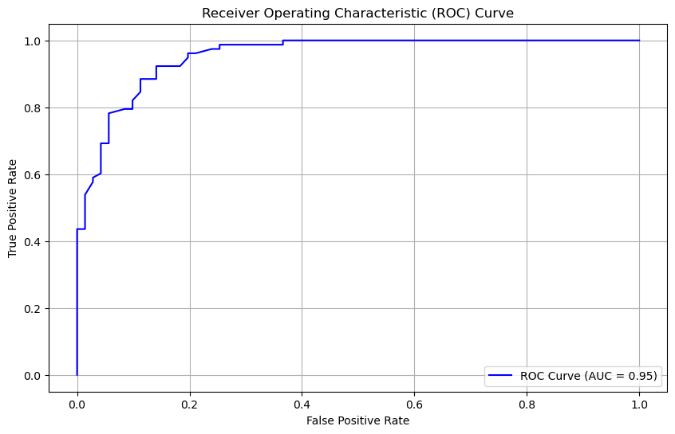
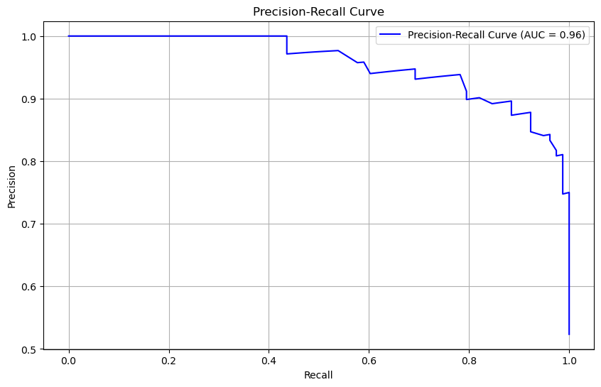

# Gender Bias Detection in Job Descriptions

## Project Overview

This project focused on detecting gender bias in job descriptions using various machine learning algorithms. The primary goal was to develop and evaluate predictive models to classify job descriptions based on the presence of gender bias, specifically looking at communal and agentic word counts. The advanced features of this project included handling class imbalance, implementing a machine learning pipeline, and evaluating multiple models.

## Data Source

The dataset used in this project was sourced from the [Data Science Salary Estimator](https://github.com/PlayingNumbers/ds_salary_proj/blob/master/eda_data.csv) project, created by [PlayingNumbers](https://github.com/PlayingNumbers/ds_salary_proj).

### Web Scraping from Source Dataset

The original project from which the dataset was obtained tweaked the web scraper GitHub repo to scrape 1000 job postings from Glassdoor.com, collecting data on job title, salary estimate, job description, rating, company, location, company headquarters, company size, company founded date, type of ownership, industry, sector, revenue, and competitors.

### Data Cleaning from Source Dataset

The data was cleaned to make it usable for the model:
- Parsed numeric data out of salary.
- Created columns for employer-provided salary and hourly wages.
- Removed rows without salary.
- Parsed rating out of company text.
- Created a new column for company state.
- Added a column indicating if the job was at the company’s headquarters.
- Transformed founded date into the age of the company.
- Created columns for the presence of different skills in the job description (Python, R, Excel, AWS, Spark).
- Added columns for simplified job title and seniority.
- Created a column for description length.

### Data Collection from Source Dataset

- **Method:** Scraped over 1000 job descriptions from Glassdoor using Python and Selenium.
- **Features Collected:**
  - Job title
  - Salary estimate
  - Job description
  - Company rating
  - Company name
  - Location
  - Company headquarters
  - Company size
  - Company founded date
  - Type of ownership
  - Industry
  - Sector
  - Revenue
  - Competitors

## Advanvanced Features
The source dataset was further transformed for the purposes of this project.

### 1. Data Preprocessing

- **Handling Missing Values:** Missing values in the dataset were imputed using appropriate strategies, ensuring no loss of data integrity.
- **Feature Encoding:** Categorical features were encoded using `OneHotEncoder` for nominal variables and label encoding for ordinal variables.

- **Feature Scaling:** Numerical features were scaled using `StandardScaler` to standardize the range of values, which is particularly important for algorithms like K-Nearest Neighbors (KNN).

### 2. Feature Engineering

- **Agentic and Communal Word Counts:** New features were engineered by counting the occurrences of agentic and communal words in job descriptions.

- **Text Length Features:** Features such as the length of the job description were included to provide additional context for the models.

Key features in the processed dataset included:
- **Numerical Features**: `word_count`, `age`, `min_salary`, `avg_salary`, `max_salary`, `Rating`, `Founded`
- **Categorical Features**: `job_state_encoded`, `num_comp_encoded`, `job_simp_encoded`, `headquarters_state_encoded`, `Sector_encoded`, `employer_provided`, `num_comp`, `Industry_encoded`, `same_state`, `aws`, `Type of ownership_encoded`, `seniority_encoded`, `hourly`, `spark`, `python_yn`, `R_yn`

- **Target Variable**: `Gender_Bias` (binary, indicating the presence or absence of gender bias based on a threshold of the ratio of `Agentic_Count` to `Communal_Count`)

### 3. Model Selection

- **Algorithms Assessed:**
  - **Random Forest:**
  - **XGBoost:**
  - **Logistic Regression:** 
  - **K-Nearest Neighbors (KNN):** 
- **Best Performing Model:** Radom Forest

## Random Forest Classifier

A Random Forest Classifier was employed to predict gender bias. The model was trained and evaluated using the following metrics:
- **Accuracy**: 87.25%
- **Confusion Matrix**: Provides insight into the number of correct and incorrect predictions for each class.
- **Classification Report**: Detailed precision, recall, and F1-score for each class.

### Key Hyperparameters

The optimal hyperparameters for the Random Forest model were determined using GridSearchCV. The best hyperparameters identified were:
- `max_depth`: None
- `min_samples_leaf`: 1
- `min_samples_split`: 5
- `n_estimators`: 100

### Evaluation Metrics

- **Confusion Matrix**: 

    |            | Predicted 0 | Predicted 1 |
    |------------|-------------|-------------|
    | Actual 0   | 63          | 8           |
    | Actual 1   | 11          | 67          |

- **Classification Report**:

    | Class | Precision | Recall | F1-Score | Support |
    |-------|-----------|--------|----------|---------|
    | 0     | 0.85      | 0.89   | 0.87     | 71      |
    | 1     | 0.89      | 0.86   | 0.88     | 78      |
    | Accuracy |       |        | 0.87     | 149     |
    | Macro Avg | 0.87  | 0.87   | 0.87     | 149     |
    | Weighted Avg | 0.87 | 0.87 | 0.87     | 149     |

- **Feature Importance**:

The analysis of feature importance revealed that the most influential features in predicting gender bias were:
- `desc_len`
- `Sentiment`
- `max_salary`
- `avg_salary`
- `min_salary`

Features such as `employer_provided`, `hourly`, and `R_yn` were found to have minimal impact.

### Feature Importances Table

    | Feature          | Importance |
    |------------------|------------|
    | desc_len         | 0.154      |
    | Sentiment        | 0.132      |
    | max_salary       | 0.124      |
    | avg_salary       | 0.115      |
    | min_salary       | 0.105      |
    | Sector_encoded   | 0.098      |
    | Industry_encoded | 0.090      |
    | employer_provided| 0.045      |
    | hourly           | 0.039      |
    | R_yn             | 0.037      |

- **Hyperparameter Tuning:** Grid search and random search were used to optimize model parameters, enhancing performance.
- **Cross-Validation:** A 5-fold cross-validation approach was employed to ensure robust model evaluation and prevent overfitting.

### 4. Addressing Class Imbalance

- **SMOTE (Synthetic Minority Over-sampling Technique):** Applied to oversample the minority class (Gender_Bias = 1), creating a balanced dataset for training.
- **Cost-Sensitive Learning:** Implemented to assign higher penalties for misclassifying the minority class, thereby improving recall.

### 5. Model Evaluation Metrics

- **Accuracy:** Overall accuracy of the model predictions.
- **Precision, Recall, and F1-score:** Detailed metrics for both classes, with a focus on improving the recall for the minority class (Gender_Bias = 1).
- **Confusion Matrix:** Used to visualize the performance of the models and understand misclassification patterns.

### 6. Implementation Details

- **Libraries Used:**
  - `scikit-learn`: For model training, evaluation, preprocessing, and hyperparameter tuning.
  - `pandas`: For data manipulation and preprocessing.
  - `numpy`: For numerical operations and data handling.
  - `imbalanced-learn`: For implementing SMOTE to address class imbalance.
  - `matplotlib`: For visualizing performance metrics, including ROC and Precision-Recall curves.
  - `seaborn`: For enhanced data visualization and plotting.
  - `statsmodels`: For statistical analysis and model diagnostics.

- **Pipeline Workflow:**
  - Data was preprocessed to handle missing values and encode categorical features.
  - Numerical features were scaled.
  - Models were trained using the processed data.
  - Hyperparameters were tuned using grid search and cross-validation.
  - Model performance was evaluated on a separate test set.

### 7. Key Insights and Challenges

- **Handling Imbalance:** Effective handling of class imbalance was crucial for improving the detection of the minority class. SMOTE and cost-sensitive learning were key techniques used.
- **Feature Importance:** Random Forest and XGBoost provided insights into feature importance, helping to understand which features contributed most to the predictions.
- **Model Performance:** While Random Forest and XGBoost outperformed other models in overall accuracy, KNN offered simplicity and showed potential with appropriate parameter tuning.
- **Challenges Addressed:** The biggest challenge was the class imbalance, which was addressed through multiple techniques, including SMOTE and cost-sensitive learning.

## Results

A Random Forest Classifier was employed to predict gender bias. The model was trained and evaluated using the following metrics:
- **Accuracy**: 87.25%
- **Confusion Matrix**: Provides insight into the number of correct and incorrect predictions for each class.
- **Classification Report**: Detailed precision, recall, and F1-score for each class.

#### Key Hyperparameters

The optimal hyperparameters for the Random Forest model were determined using GridSearchCV. The best hyperparameters identified were:
- `max_depth`: None
- `min_samples_leaf`: 1
- `min_samples_split`: 5
- `n_estimators`: 100

### Evaluation Metrics

- **Confusion Matrix**: 

    

    |            | Predicted 0 | Predicted 1 |
    |------------|-------------|-------------|
    | Actual 0   | 63          | 8           |
    | Actual 1   | 11          | 67          |

- **Classification Report**:

    | Class | Precision | Recall | F1-Score | Support |
    |-------|-----------|--------|----------|---------|
    | 0     | 0.85      | 0.89   | 0.87     | 71      |
    | 1     | 0.89      | 0.86   | 0.88     | 78      |
    | Accuracy |       |        | 0.87     | 149     |
    | Macro Avg | 0.87  | 0.87   | 0.87     | 149     |
    | Weighted Avg | 0.87 | 0.87 | 0.87     | 149     |

- **ROC Curve**: 

    

    The AUC score was 0.92, indicating strong performance in distinguishing between classes.

- **Precision-Recall Curve**:

    

    The AUC score was 0.93, reflecting the model's precision and recall.

## Feature Importance

The analysis of feature importance revealed that the most influential features in predicting gender bias were:
- `desc_len`
- `Sentiment`
- `max_salary`
- `avg_salary`
- `min_salary`

Features such as `employer_provided`, `hourly`, and `R_yn` were found to have minimal impact.

### Feature Importances Table

    | Feature          | Importance |
    |------------------|------------|
    | desc_len         | 0.154      |
    | Sentiment        | 0.132      |
    | max_salary       | 0.124      |
    | avg_salary       | 0.115      |
    | min_salary       | 0.105      |
    | Sector_encoded   | 0.098      |
    | Industry_encoded | 0.090      |
    | employer_provided| 0.045      |
    | hourly           | 0.039      |
    | R_yn             | 0.037      |

## Limitations
The analysis had several limitations:
The assignment of communal and agentic words was subjective, potentially introducing bias.
The model's accuracy is dependent on the quality and representativeness of the data.
The dataset was limited to job descriptions related to data science, which may affect the model's applicability to other industries or regions.
The model only considered textual and basic numerical features, possibly overlooking other indicators of bias.

## Future Work
Future improvements could include:
Further hyperparameter tuning
Advanced feature engineering
Comparison with other classifiers
Expansion of the dataset to include diverse job descriptions

The project successfully implemented a comprehensive machine learning pipeline to detect gender bias in job descriptions. Through advanced preprocessing, feature engineering, and careful handling of class imbalance, the models developed showed promising results. Ongoing efforts will focus on further refining the models and exploring additional techniques to improve the detection of the minority class.

## Conclusion
The Random Forest Classifier model effectively identified gender bias in job descriptions, achieving an accuracy of 87.25% and demonstrating balanced performance across both classes. The model's strong performance, as evidenced by the ROC and Precision-Recall curves, underscores its potential for practical application in promoting fairness in hiring practices. The feature importance analysis provided valuable insights into the key factors contributing to gender bias, guiding future work towards developing more inclusive job descriptions. Future research could enhance the model's performance further by exploring additional features, classifiers, and datasets to broaden its applicability.

## Acknowledgments
Special thanks to [Data Source] for providing the dataset and [https://github.com/PlayingNumbers/ds_salary_proj/blob/master/eda_data.csv] for the source data used.